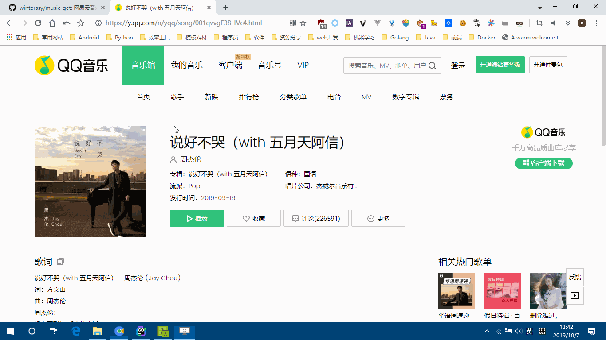
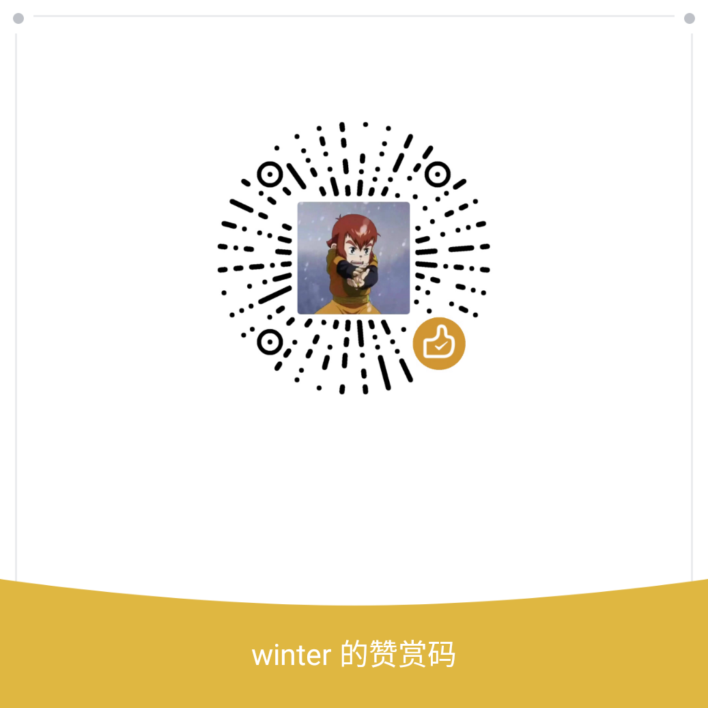

# Music-Get

一键下载你喜欢的单曲/专辑/歌单/歌手热门歌曲。

[](https://github.com/winterssy/music-get/actions)
[](https://github.com/winterssy/music-get/releases)
[](/LICENSE)



## 支持的音乐平台

|              音乐平台               |        单曲        |        专辑        |        歌单        |    歌手热门歌曲    |
| :---------------------------------: | :----------------: | :----------------: | :----------------: | :----------------: |
| [网易云音乐](https://music.163.com) | :heavy_check_mark: | :heavy_check_mark: | :heavy_check_mark: | :heavy_check_mark: |
|     [QQ音乐](https://y.qq.com)      | :heavy_check_mark: | :heavy_check_mark: | :heavy_check_mark: | :heavy_check_mark: |
| [咪咕音乐](http://music.migu.cn/v3) | :heavy_check_mark: | :heavy_check_mark: | :heavy_check_mark: | :heavy_check_mark: |
|  [酷狗音乐](http://www.kugou.com)   | :heavy_check_mark: | :heavy_check_mark: | :heavy_check_mark: | :heavy_check_mark: |

## 下载安装

```sh
$ go get -u github.com/winterssy/music-get
```

普通用户可前往 [Releases](https://github.com/winterssy/music-get/releases) 标签下载程序的最新编译版本。

## 如何使用？

直接将音乐地址作为命令行参数传入即可，如：

- 下载单曲：
```sh
$ music-get https://music.163.com/#/song?id=553310243
$ music-get https://y.qq.com/n/yqq/song/002Zkt5S2z8JZx.html
$ music-get http://music.migu.cn/v3/music/song/63273402938
```

- 下载专辑：
```sh
$ music-get https://music.163.com/#/album?id=38373053
$ music-get https://y.qq.com/n/yqq/album/002fRO0N4FftzY.html
$ music-get http://music.migu.cn/v3/music/album/1121438701
```

- 下载歌单：
```sh
$ music-get https://music.163.com/#/playlist?id=156934569
$ music-get https://y.qq.com/n/yqq/playsquare/5474239760.html
$ music-get http://music.migu.cn/v3/music/playlist/159248239
```

- 下载歌手热门歌曲：
```sh
$ music-get https://music.163.com/#/artist?id=13193
$ music-get https://y.qq.com/n/yqq/singer/000Sp0Bz4JXH0o.html
$ music-get http://music.migu.cn/v3/music/artist/112
```

命令选项：

- `-v`：调试模式（**提issue前请开启调试并附上log，以便开发者解决问题**）。
- `-f`：是否覆盖已下载的音乐，默认跳过。
- `-n`：并发下载任务数，最大值16，默认1，即单任务下载。
- `-h`：获取命令帮助。

**注意事项：** 

- 如果音乐地址含有诸如 `&` 等shell元字符，请将地址用单引号 `''` 包围起来。
- 命令选项必须先于其它命令行参数输入。

## FAQ

- 为什么网易云音乐需要登录？

  > 因为网易云音乐反爬，不登录会被服务端识别成欺诈而无法下载。程序会存储cookie到本地，但如果cookie失效了你需要再次登录，一般是每两周需要重新登录一次。目前仅支持手机登录方式。

- 是否支持一键下载网易云音乐『我喜欢的音乐』列表？

  > 支持。它本质上是一个歌单。

- 支持其它音乐平台？

  > 如果你发现了其它音乐平台比较全的API，请提交Issue，开发者验证可行的话将会在后续版本实现。同时你也可以fork本项目的源码二次开发（须遵循GPL协议），只须实现 `MusicRequest` 接口即可，欢迎PR。

- 下载中断/失败的原因？

  > 网络状态不佳导致响应超时；触发了服务端的反爬机制（下调并发下载任务数/隔一段时间再试）；音乐提供商变更了API（这种情况下请提issue反馈）。网易云音乐不支持下载需要付费/VIP才能试听的歌曲。

## 开发者捐赠

说明：无论是否捐赠，你都可以自由的使用本程序，无任何限制。捐赠仅用于支持项目的开发。



## 致谢

- [Binaryify/NeteaseCloudMusicApi](https://github.com/Binaryify/NeteaseCloudMusicApi)
- [nondanee/UnblockNeteaseMusic](https://github.com/nondanee/UnblockNeteaseMusic)

## 免责声明

- 本项目仅供学习研究使用，禁止商业用途。
- 本项目使用的接口如无特别说明均为官方接口，音乐版权归源音乐平台所有，侵删。

## License

GPLv3。
